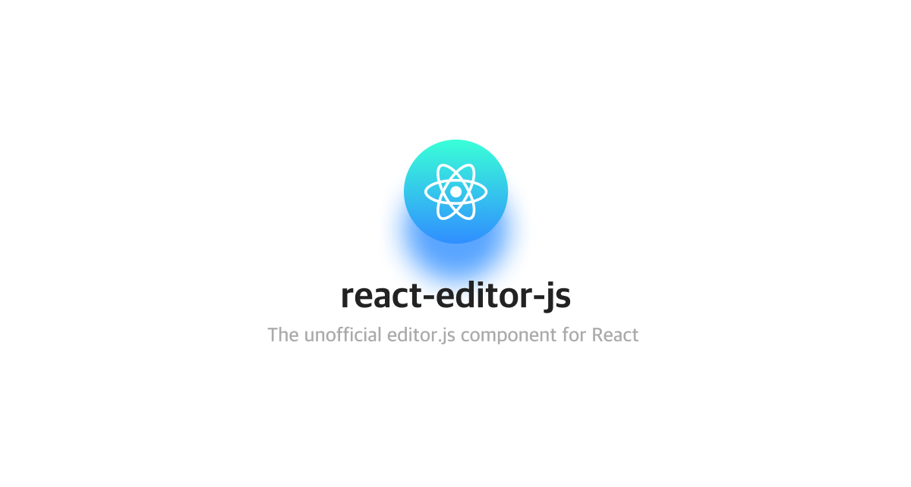

<div align="center">
  
</div>

<br>

<div>

[](https://badge.fury.io/js/react-editor-js)

[](https://github.com/Jungwoo-An/react-editor-js/actions)
[](https://github.com/semantic-release/semantic-release)

</div>

## 🍞 DEMO

- [CodeSandbox](https://codesandbox.io/s/react-editor-js-v2-34bfl)

## 🍀 Supported Official Plugin

- [x] Paragraph (default)
- [x] Embed
- [x] Table
- [x] List
- [x] Warning
- [x] Code
- [x] Link
- [x] Image
- [x] Raw
- [x] Header
- [x] Quote
- [x] Marker
- [x] CheckList
- [x] Delimiter
- [x] InlineCode
- [x] SimpleImage

## 🤟🏻 Getting Started

### Install via npm (or yarn)

```bash
npm install --save react-editor-js @editorjs/editorjs @editorjs/paragraph ...other plugins
```

```tsx
import { createReactEditorJS } from 'react-editor-js'

const ReactEditorJS = createReactEditorJS()

<ReactEditorJS defaultValue={blocks} />
```

## 📙 API

Allow all options of [editor-js](https://github.com/codex-team/editor.js/blob/master/types/configs/editor-config.d.ts)

| Name               | Type                                                                            | Description                                                                                                                                           |
| ------------------ | ------------------------------------------------------------------------------- | ----------------------------------------------------------------------------------------------------------------------------------------------------- |
| defaultValue | OutputData                                                                         | Initial data when using editor js as [uncontrolled component](https://ko.reactjs.org/docs/uncontrolled-components.html). highly recommend it                                                                                                         |
| value | OutputData                                                                         | data when using editor js as [controlled component](https://ko.reactjs.org/docs/forms.html#controlled-components). <br> ⚠️ Don't use it with onChange prop. Infinite loops can occur.                                                                                                         |
| onInitialize            | (editorCore?: EditorCore) => void                                                   | Call after editor-js is initialized                                                                                       |

## 🧐 FAQ

### How can I install plugins?

There is an only Paragraph block already included in Editor.js. Probably you want to use several Block Tools that should be installed and connected.

To add more Block Tools, simply add them to your repo and pass them as `tools`-property to your editor:

```
npm install --save-dev @editorjs/checklist
```

```tsx
import { createReactEditorJS } from 'react-editor-js'
import CheckList from '@editorjs/checklist'

const ReactEditorJS = createReactEditorJS()

<ReactEditorJS defaultValue={blocks} tools={{ checkList: CheckList }} />
```

We recommend to create a `tools.js` file and export your tools as a constant. Here is an example using all of the default plugins:

```ts
// tools.js
import Embed from '@editorjs/embed'
import Table from '@editorjs/table'
import Paragraph from '@editorjs/paragraph'
import List from '@editorjs/list'
import Warning from '@editorjs/warning'
import Code from '@editorjs/code'
import LinkTool from '@editorjs/link'
import Image from '@editorjs/image'
import Raw from '@editorjs/raw'
import Header from '@editorjs/header'
import Quote from '@editorjs/quote'
import Marker from '@editorjs/marker'
import CheckList from '@editorjs/checklist'
import Delimiter from '@editorjs/delimiter'
import InlineCode from '@editorjs/inline-code'
import SimpleImage from '@editorjs/simple-image'

export const EDITOR_JS_TOOLS = {
  // NOTE: Paragraph is default tool. Declare only when you want to change paragraph option.
  // paragraph: Paragraph,
  embed: Embed,
  table: Table,
  list: List,
  warning: Warning,
  code: Code,
  linkTool: LinkTool,
  image: Image,
  raw: Raw,
  header: Header,
  quote: Quote,
  marker: Marker,
  checklist: CheckList,
  delimiter: Delimiter,
  inlineCode: InlineCode,
  simpleImage: SimpleImage,
}
```

```tsx
import { createReactEditorJS } from 'react-editor-js'
import { EDITOR_JS_TOOLS } from './tools'

const ReactEditorJS = createReactEditorJS()

<ReactEditorJS defaultValue={blocks} tools={EDITOR_JS_TOOLS} />
```

You can read more about plugins/tools at [editor-js: Tools installation](https://editorjs.io/getting-started#tools-installation)

### How do I use custom element?

It's simpleeeee

```tsx
<ReactEditorJS holder="custom">
  <div id="custom" />
</ReactEditorJS>
```

### How to access editor-js instance?

The editor-js instance is inaccessible. However, you can access the abstracted editor-js for isomorphic react-editor-js.

```ts
// abstracted editor-js interface
interface EditorCore {
  destroy(): Promise<void>

  clear(): Promise<void>

  save(): Promise<OutputData>

  render(data: OutputData): Promise<void>
}
```

```tsx
const editorCore = React.useRef(null)

const handleInitialize = React.useCallback((instance) => {
  editorCore.current = instance
}, [])

const handleSave = React.useCallback(async () => {
  const savedData = await editorCore.current.save();
}, [])

<ReactEditorJS onInitialize={handleInitialize} defaultValue={blocks} />
```

If you want to access low-level instance, you can use `dangerouslyLowLevelInstance`

⚠️ dangerouslyLowLevelInstance depends on the execution environment.

| Environment | Instnace Type |
| - | - |
| Browser | EditorJS instance|
| NodeJS | null |

```tsx
const editorCore = React.useRef(null)

const handleInitialize = React.useCallback((instance) => {
  editorCore.current = instance
}, [])

const handleSave = React.useCallback(async () => {
  const savedData = await editorCore.current.dangerouslyLowLevelInstance?.save();
}, [])

<ReactEditorJS onInitialize={handleInitialize} defaultValue={blocks} />
```

### Haven't received data from server (when use Link)

You should set linkTool [config](https://github.com/editor-js/link#usage). 💪🏻

```tsx
import LinkTool from '@editorjs/link'

<ReactEditorJS
  defaultValue={blocks}
  tools={{
    linkTool: {
      class: LinkTool,
      config: {
        endpoint: 'http://localhost:8008/fetchUrl', // Your backend endpoint for url data fetching
      }
    }
  }}
/>
```
